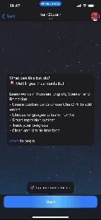

# Turn2Learn Bot 🤖

A Telegram bot for learning words using flashcards. Supports multilingual cards and smart repetition algorithms.

## Try it out! 🚀
You can try the bot without installation by clicking this link: [@Turn2Learn_bot](https://t.me/Turn2Learn_bot)

## Demo 📱


## Why Turn2Learn? 🎯
- 📚 Learn multiple languages simultaneously
- 🧠 Smart spaced repetition for better memorization
- 🎮 Gamified learning process
- 📊 Progress tracking and statistics
- 🤖 GPT integration for bulk card creation
- 🌍 Support for 4 languages with easy expansion

## Features 🚀

### Core Features
- ✨ Support for 4 interface languages (🇷🇺 RU, 🇬🇧 EN, 🇪🇸 ES, 🇷🇴 RO)
- 📝 Create cards with translations in different languages
- 🔄 Smart repetition algorithm based on statistics
- 📊 Learning progress tracking
- 🎯 Customizable study languages (front/back)

### Operating Modes
1. **Adding Cards**
   - Manual translation input
   - Bulk adding through GPT (special format support)
   - Duplicate checking

2. **Learning Mode**
   - Smart card selection for repetition
   - Success statistics for each card
   - Knowledge assessment system (✅/❌)

3. **Card Management**
   - View all cards
   - Edit translations
   - Delete cards

## Installation and Launch 🛠

### Local Launch (without Docker)

1. **Clone the repository:**
```bash
git clone https://github.com/your-username/Turn2Learn.git
cd Turn2Learn
```

2. **Create a virtual environment:**
```bash
python -m venv venv
source venv/bin/activate  # Linux/Mac
# or
venv\\Scripts\\activate  # Windows
```

3. **Install dependencies:**
```bash
pip install -r requirements.txt
```

4. **Configure environment variables:**
- Create `.env` file
- Add your bot token:
```
BOT_TOKEN=your_bot_token_here
```

5. **Start the bot:**
```bash
python bot.py
```

### Docker Launch 🐳

1. **Install Docker:**
- [Docker Installation Guide](https://docs.docker.com/get-docker/)

2. **Clone the repository and navigate to the project directory:**
```bash
git clone https://github.com/your-username/Turn2Learn.git
cd Turn2Learn
```

3. **Create `.env` file with your bot token:**
```
BOT_TOKEN=your_bot_token_here
```

4. **Build and run Docker container:**
```bash
docker build -t turn2learn .
docker run -d --env-file .env turn2learn
```

## Project Structure 📁

```
Turn2Learn/
├── bot.py              # Main bot file
├── requirements.txt    # Project dependencies
├── .env               # Configuration (bot token)
├── data/              # Data storage
│   ├── user_data.json     # User data
│   └── default_cards.json # Default cards
├── keyboards/         # Bot keyboards
├── locales/          # Interface translations
└── utils/            # Helper functions
```

## Bot Usage 📱

1. **First Launch:**
   - Send `/start` command
   - Choose interface language
   - Go to settings and select study languages

2. **Adding Cards:**
   - Click "Add Card"
   - Enter translations for desired languages
   - Or use GPT for bulk adding

3. **Learning Mode:**
   - Click "Learn"
   - View word in selected language
   - Check translation
   - Mark result (know/don't know)

4. **Card Management:**
   - In "My Cards" section you can:
     - View all cards
     - Edit translations
     - Delete unnecessary cards

## Automatic Restart (for VPS) 🔄

For automatic container restart on crashes or server reboot, add the `--restart` parameter:

```bash
docker run -d --restart unless-stopped --env-file .env turn2learn
```

## Backup 💾

All user data is stored in `data/user_data.json`. It's recommended to regularly backup this file.

## Support and Development 🤝

If you have suggestions for improving the bot or found a bug, please create an Issue or Pull Request in the repository.

## Requirements 📋
- Python 3.11 or higher
- Docker (optional, for containerized deployment)
- Telegram Bot Token (get it from [@BotFather](https://t.me/BotFather))

## Contributing 🤝
We welcome contributions! Here's how you can help:

1. 🐛 Report bugs and suggest features in Issues
2. 📝 Improve documentation
3. 🌍 Add new language translations
4. 💻 Submit Pull Requests

## Tech Stack 🛠
- [Python 3.11](https://www.python.org/)
- [aiogram 3.3.0](https://docs.aiogram.dev/) - Modern Telegram Bot framework
- [Docker](https://www.docker.com/) - Containerization

## License 📄
This project is licensed under the MIT License - see the [LICENSE](LICENSE) file for details. 
